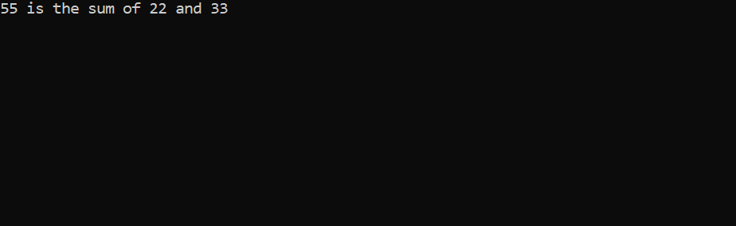

<!--comment-->
__P__~~r~~_e_`processor`

### preprocessor

- [x] #define name "hamza ali"
- [x] #define uap printf("University Of Asia Pacific\n");
- [x] #define PI 3.1416

```c
#include<stdio.h>
#define name "Hamza Ali"
#define uap printf("University Of Asia Pacific\n");
#define PI 3.1416
int main()
{
    printf("%s\n",name);
    uap;
    printf("%f\n",PI);
    getchar();
}
```  
<image src="./images/preprocessor.png"/>

### sum

```c
#include<stdio.h>
#define a 22
#define b 33

int main()
{
    printf("%d is the sum of %d and %d\n",a+b,a,b);
    getchar();
}
```
  

### Header file 

<p> create new file & add it to the main file </p>

- [x] #include "info.h"

```c
#include<stdio.h>
#include "info.h"
int main()
{
    printf("%s\n",name);
    uap;
    printf("%d is the sum of %d and %d \n",a+b,a,b);
    
    getch();
}
```  
<p> creat new empty file with main file. Then, add it by this</p>

```c
#define name "Hamza Ali"
#define a 22
#define b 33
#define uap printf("University Of Asia Pacific\n");
```  

<image src="./images/mainfile.png"/>
<image src="./images/header.png"/>
<image src="./images/output.png"/>
